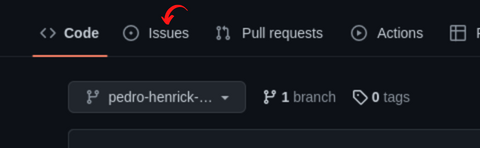
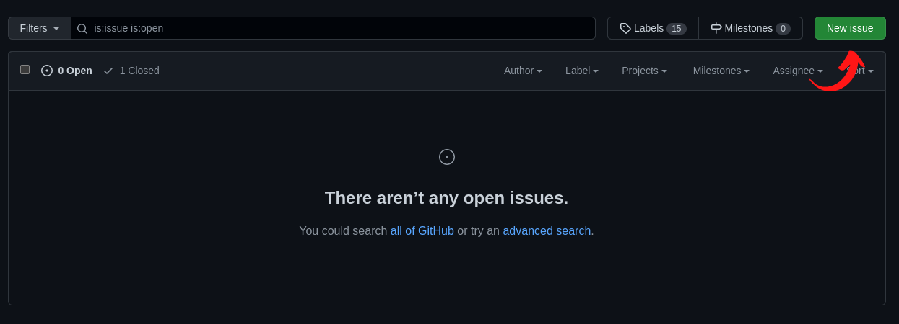
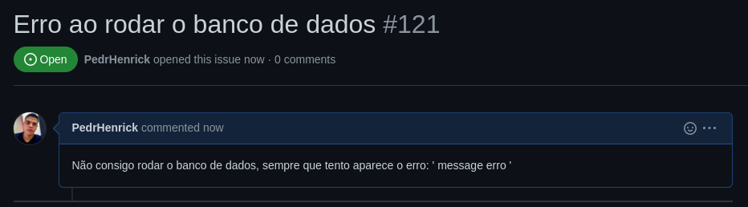

# Olá  Bem vindo ao repositório do projeto **Docker Todo List** 🐳📝!

### Esse foi o meu primeiro contato com o Docker. Fizemos esse projeto na trybe com o intuito de praticar os comandos básicos do docker, além da criação do `Dockerfile` e orquestrando tudo com `docker-compose`.

---

## **Orientações:**

### **Tecnologias utilizada:**

> Docker
> 

  
<strong>Como clonar os arquivos 📝</strong>

  
<h3>
  Para que essa aplicação funcione na sua máquina, será necessário seguir os seguintes passos:
  
  <strong>Obs: Será necessário ter o DOCKER instalado na sua máquina. Neste <a href="https://blog.betrybe.com/tecnologia/docker/" target="_blank">link</a>, você verá um pouco sobre o que é, como funciona e como instalar o docker!</strong>

  * 1 - Abra o CMD/terminal de comando do seu sistema através da pesquisa e faça os seguintes passo:
  
    - Se você utiliza `linux` ou `mac` em português, digite `cd Área\ de\ Trabalho` e em seguida `mkdir project-todo-list` para que seja criada a pasta onde você fará o clone do projeto. Essa pasta será criada na tela inicial;
    - Caso utilize o `windows` ou o linux e mac em inglês, digite `cd desktop` e em seguida `mkdir project-todo-list` para que seja criada a pasta onde você fará o clone do projeto. Essa pasta assim como da outra forma, será criada na tela inicial;
  
  * 2 - Em seguida utilize o comando `cd project-todo-list` para entrar na pasta criada
  
  * 3 - Dentro da pasta, no terminal, utilize o comando `git clone git@github.com:PedrHenrick/Project-Todo-List.git` para clonar a pasta do repositório
  
  * 4 - Logo depois entre na pasta clonada utilizando o comando `cd Project-Todo-List`

  * 5 - Rode toda a aplicação utilizando o comando `docker-compose up -d`

  E pronto! Se tudo ocorreu bem, já temos nossa aplicação na sua máquina rodando neste [link](http://localhost:3000/). Agora você já pode fechar o terminal e abrir a pasta que está na área de trabalho, em seguida a pasta com o nome do projeto. Lá você verá duas pastas principais, uma com toda a aplicação que iremos dockerizar e outra com comandos do docker que realizam as atividades que foram pedidas na aba de <a href="#desafios">desafios</a>.
  </h3>
   

  
<strong>O que fazer quando encontrar erros 🚫</strong>

  <h3>
    Caso encontre algum erro referente a sintaxe ou funcionamento do mesmo, abra uma `Issue`
  </h3>
  
  * <h3>1 - Para iniciarmos, clique em <strong>issues</strong> como na foto abaixo:</h3>
  
    
  
  * <h3>2 - Após isso, clique em <strong>new issue:</strong></h3>
  
    
  
  * <h3>3 - Agora adicione um título sobre problema encontrado, adicione uma descrição mostrando como ocorreu o erro e por fim clique no botão <strong>submit new issue</strong>:</h3>
  
    
  
  * <h3>E pronto, o problema já foi documentado e será resolvido o mais rápido possível.</h3>
  
    
  
  <h3>Temos também a opção de utilizar o <a href="#form">formulário de feedback</a> encontrado no fim desse arquivo!!</h3>
   

  
<strong>O que fazer após o code-review ✅</strong>

  <h3>
    Após o seu review sobre tudo o que foi abordado, deixo como sugestão responder este <a href="https://forms.gle/ZJjEZNEAuc9QUauY9" target="_blank">formulário de feedback</a>, desenvolvido por mim para auxiliar na melhoria desse e de outros projetos.
  </h3>
  <h3>
    Aguardo sua resposta, obrigado!
  </h3>

---

## **Desafios:**

#### 1. Crie um novo container de modo interativo sem roda-lo nomeando-o como `01container` e utilizando a imagem `alpine` usando a versão `3.12`

  - **Observações técnicas:** 
    - O container **não deve ser inicializado**, somente criado;
    - O container deve estar preparado para acesso interativo;
    - O container vai ter o `name`: `01container`;
    - O container vai estar usando a imagem `alpine` na versão `3.12`.

#### 2. Inicie o container `01container`

  - **Observações técnicas:** 
    - O container que está parado, deve ser iniciado;
    - Se o container tiver sido iniciado de modo interativo, ele deve se manter ativo ao inicia-lo.

#### 3. Liste os containers filtrando pelo nome `01container`

#### 4. Execute o comando `cat /etc/os-release` no container `01container` sem se acoplar a ele

  - **Observações técnicas:**
    - O container deve estar rodando, e você deve ser capaz de **executar um comando** nesse container.

#### 5. Remova o container `01container` que está em andamento.

#### 6. Faça o download da imagem `nginx` com a versão `1.21.3-alpine` sem criar ou rodar um container.

#### 7. Rode um novo container com a imagem  `nginx` com a versão `1.21.3-alpine` em segundo plano nomeando-o como `02images` e mapeando sua porta padrão de acesso para porta `3000` do sistema hospedeiro.

#### 8. Pare o container `02images` que está em andamento.

## Dockerfile

#### 9. Gere uma build a partir do Dockerfile do `back-end` do `todo-app` nomeando a imagem para `todobackend`.
  
  - **Observações técnicas:**
    - O Dockerfile deve rodar uma imagem `node` utilizando a versão `14`;
    - Recomenda-se o uso da variante `-alpine`, pois ela é otimizada para desempenho;
    - Deve estar com a porta `3001` exposta;
    - Deve adicionar o arquivo `node_modules.tar.gz` a imagem;
    - Deve copiar todos os arquivos da pasta `back-end` para a imagem;
    - Ao iniciar a imagem deve rodar o comando `npm start`.
    - Se ao *buildar* o Dockerfile o nome da imagem gerada é igual a `todobackend`.

#### 10. Gere uma build a partir do Dockerfile do `front-end` do `todo-app` nomeando a imagem para `todofrontend`.
 
  - **Observações técnicas:**
    - O `Dockerfile` pode rodar uma imagem `node` utilizando a versão `14`;
    - Recomenda-se o uso da variante `-alpine`, pois ela é otimizada para desempenho;
    - Deve estar com a porta `3000` exposta;
    - Deve adicionar o arquivo `node_modules.tar.gz` a imagem, de maneira que ele seja extraído dentro do `container`;
    - Deve copiar todos os arquivos da pasta `front-end` para a imagem;
    - Ao iniciar a imagem deve rodar o comando `npm start`;
    - Se ao *buildar* o `Dockerfile` o nome da imagem gerada é igual a `todofrontend`.

#### 11.Gere uma build a partir do Dockerfile dos `testes` do `todo-app` nomeando a imagem para `todotests`.

  - **Observações técnicas:** 
    - O Dockerfile deve rodar a imagem `mjgargani/puppeteer:trybe1.0` para que os testes funcionem;
    - Deve adicionar o arquivo `node_modules.tar.gz` a imagem;
    - Deve copiar todos os arquivos da pasta `tests` para a imagem;
    - Ao iniciar a imagem deve rodar o comando `npm test`;
    - Se ao *buildar* o Dockerfile o nome da imagem gerada é igual a `todotests`.

## Bônus

### Docker-compose

#### 12. Suba uma orquestração em segundo plano com o docker-compose de forma que `backend`, `frontend` e `tests` consigam se comunicar.

  - **tests**
    - O container de `todotests` deve ter como dependencia os containers `frontend` e `backend`;
    - O nome do _service_ deverá ser `todotests`;
    - Deve ter uma variável de ambiente `FRONT_HOST` que recebe como valor o nome do container do `frontend`

  - **front-end**
    - O container de `todofrontend` deve rodar na porta `3000`;
    - O nome do _service_ deverá ser `todofront`;
    - Deve ter como dependencia o container `backend`;
    - Deve ter uma variável de ambiente `REACT_APP_API_HOST` que recebe como valor o nome do container do `backend`.

  - **back-end**
    - O container de `todobackend` deve rodar na porta `3001`;
    - O nome do _service_ deverá ser `todoback`;
---

### Esse projeto contém arquivos desenvolvidos pela [Trybe](https://www.betrybe.com/)!
